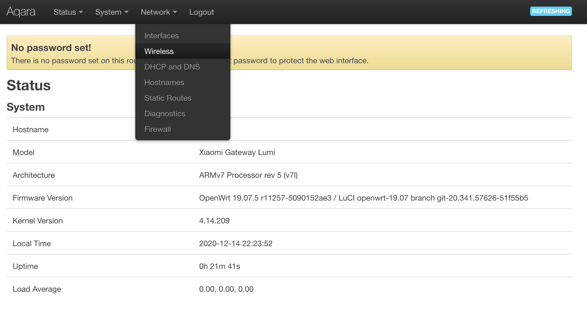
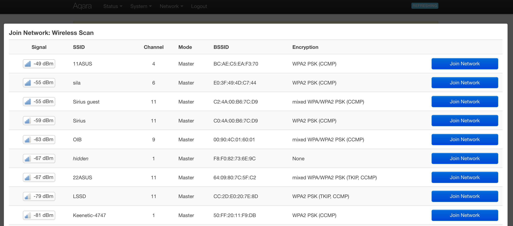
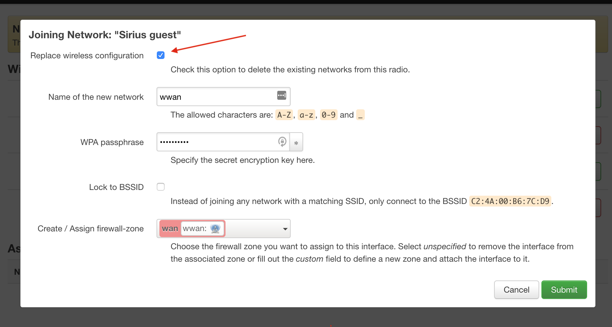
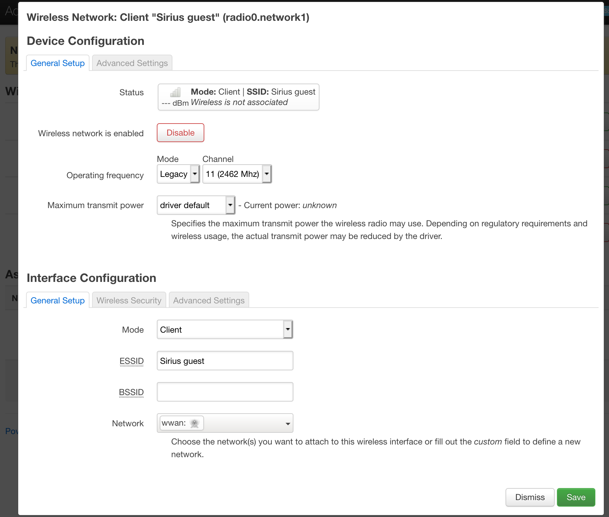
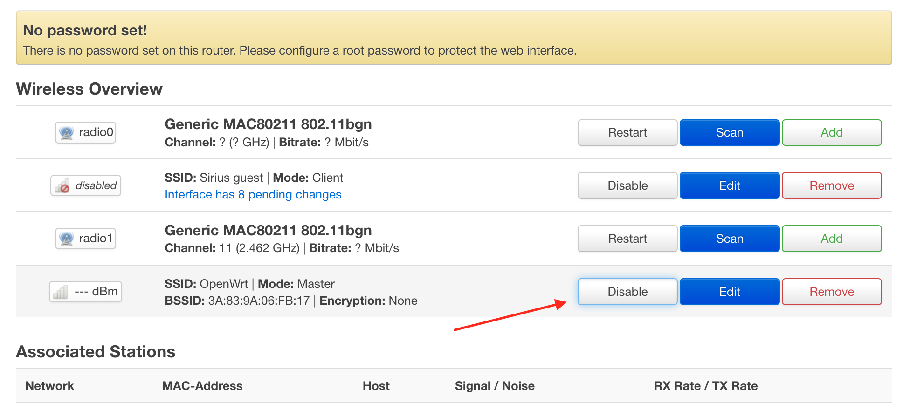
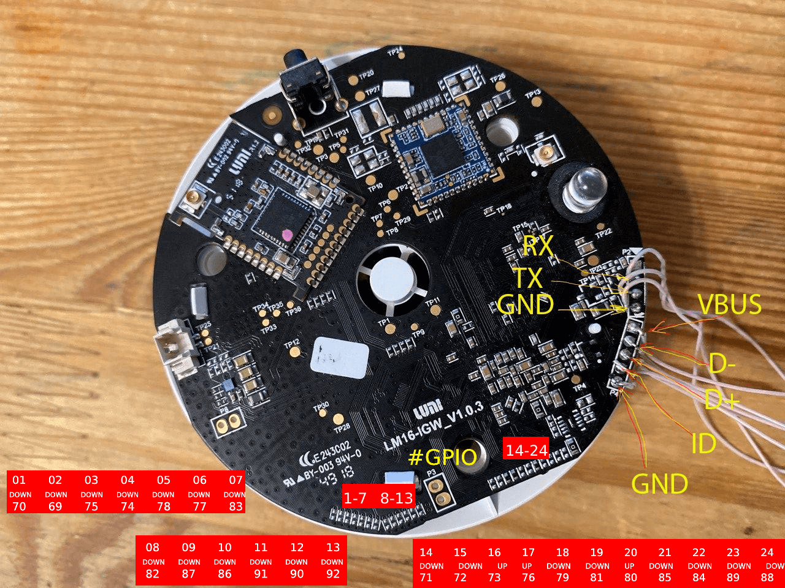

# Install an Alternate OpenWRT firmware on DGNWG05LM and ZHWG11LM gateways

These instructions apply to only to:

* The European version of the gateway mieu01 from  Xiaomi, with a European plug
* A version of the gateway from  Aqara ZHWG11LM, with a Chinese or European plug.

The instructions will not work for the Xiaomi gateway2 version, with the
Chinese plug DGNWG02LM. That version has other hardware components installed.

**Table of Contents**

- [Before you begin](#before-you-begin)
    - [Make a backup](#make-a-backup)
- [Flash your device over the air](#flash-your-device-over-the-air)
    - [Error recovery: the Over-the-Air method did not work for you](#error-recovery-the-over-the-air-method-did-not-work-for-you)
- [How to use OpenWrt](#how-to-use-openwrt)
    - [Connect the gateway to your router](#connect-the-gateway-to-your-router)
    - [Working with ZigBee](#working-with-zigbee)
    - [Other software you might want to use](#other-software-you-might-want-to-use)
- [Restore settings](#restore-settings)
    - [Reset to the defaults](#reset-to-the-defaults)
    - [Return to stock firmware](#return-to-stock-firmware)
- [Reference of general-purpose input/output (GPIO)](#reference-of-general-purpose-inputoutput-gpio)
- [Links](#links)

## Before you begin

- [ ] Get root
- [ ] Make a backup

### Get root

These instructions assume that you already have ssh access to the gateway.
If you have not done this, [follow the instructions to get root](./gain_root.md)

### Make a backup

Do make a back-up copy.

If you decide to return to the stock firmware, you will need the `tar.gz`
backup from your device, with an archive of your root filesystem.

You cannot use a `generic backup`, because all firmware contains unique
IDs and keys.

```shell
tar -cvpzf /tmp/lumi_stock.tar.gz -C / . --exclude='./tmp/*' --exclude='./proc/*' --exclude='./sys/*'
```

After the backup is done, __download it to your local computer__.

```shell
scp root@*GATEWAY_IP*:/tmp/lumi_stock.tar.gz .
```

You can also use WinScp in `scp` mode (dropbear on the gateway doesn't support sftp
mode).

Even if you already have made a rootfs image with dd, **make an archive anyway**.

During the boot phase of the dd image, nand flash or ubifs errors usually
occur. Using the `tar.gz` option avoids these drawbacks, because it
formats the flash before writing the files.

## Flash your device over the air

Flashing your device over the air (OTA) is the easiest and recommended way.
The method does not require soldering, and you can do it with a serial console
or via ssh.


Before flashing, make sure that the gateway is connected to the internet.
You also need to double-check that you don't have any redundant archives in the
`/tmp` directory. You'll need space to download the firmware binaries.

The following commands work only on stock firmware:

```shell
echo -e "GET /openlumi/owrt-installer/main/install.sh HTTP/1.0\nHost: raw.githubusercontent.com\n" | openssl s_client -quiet -connect raw.githubusercontent.com:443 -servername raw.githubusercontent.com 2>/dev/null | sed '1,/^\r$/d' | bash
```

This command stops all the processes on the gateway. If you are updating via ssh,
the connection will drop─this is normal. The flashing process takes a few
minutes. After it is done, the gateway will create an open Wi-Fi network with
the name `OpenWrt`.

### Error recovery: the Over-the-Air method did not work for you

If the preceding method fails for some reason, you can bring the gateway back
to life by soldering the usb and uart, and flashing it through `mfgtools`.

[See the instructions to flash over USB](./usb_flashing.md)

## How to use OpenWrt

After flashing, the gateway creates an open Wi-Fi network with the
name OpenWrt.

### Connect the gateway to your router

1. To connect the gateway to your router, connect to the network and go to
http://192.168.1.1/ .

    The default credentials for the gateway are:

        - login 'root': without a password.

2. Go to the section **Network > Wireless**



3. Press the **Scan** button against the first interface `radio0`. After a few
seconds, you will see a list of networks. Find your network and press **Join Network**



4. In the pop-up window, set the "Replace wireless configuration" checkbox.
Enter the passphrase from your Wi-Fi network below



5. Confirm the settings on the next window, press the **Save**.



6. To apply the changes correctly, disable Access Poing by pressing
**Disable** for the connection for the second interface.



The gateway will disconnect you from AP and apply the changes.
After the firmware, the mac address of the gateway changes, because the IP address
also most likely changes. Check it in the router or in the gateway itself.

The gateway is pre-installed:

- OpenWrt LuCi GUI on port 80 http
- command utility for flashing zigbee module jn5169
- Web plugin for LuCi to flash a firmware

Do not enable Wi-Fi AP + Station modes on the gateway at the same time.
The driver that is used in the system cannot work in two modes
at the same time.

If you changed the LuCi settings and the gateway stopped connecting to the network,
press the button on the gateway for 10 seconds. It will blink yellow 3 times
and with start the initial network configuration mode with the create Wi-Fi
Access Point.

### Working with ZigBee

The Zigbee chip can work only with a single system. You have to choose which
program you'd like to use. At the same time, you can use zigbee2mqtt to work
with Zigbee and domoticz for other automation.

1. [Installing Zigbee2mqtt](./zigbee2mqtt.md)
2. [Installing Home Assistant with ZHA component](https://github.com/openlumi/homeassistant_on_openwrt)
3. [Installing Zesp32](./zesp32.md)
4. [Installing Domoticz and configuring Zigate plugin](./domoticz-zigate.md)

### Other software you might want to use

1. [https://github.com/openlumi/lumimqtt/](https://github.com/openlumi/lumimqtt/) - a service that lets you manage gateway devices over the MQTT
2. [https://flows.nodered.org/node/node-red-contrib-xiaomi-gateway](https://flows.nodered.org/node/node-red-contrib-xiaomi-gateway) - a package for node red

## Restore settings

If you want to go back some steps, these instructions can help you.

### Reset to the defaults

**Be careful with resetting, all programs and settings will be erased.
Use it in case of emergency, when resetting Wi-Fi credentials does not help.**

To go back to the initial set up (like you just flashed the gateway), there are
two ways to erase the data on the OpenWRT:

* Hold the button.

    You must hold the gateway button for 20 seconds.
    The gateway will blink red 3 times and reset to the initial set up for
    creating a Wi-Fi Access

* UART

    Connect the gateway with the UART 2 USB adapter (like in the step
    [get root](./gain_root.md)) and wait for the system to load.

    Enter the following commands.

    ```
    firstboot -y && reboot now
    ```

### Return to stock firmware

To return to the stock firmware, you need to flash the original kernel, DTB,
and rootfs from your backup. The Kernel and DTB are the same for all gateways.
To keep the Mi Home working, you'll need your tar.gz backup.

[mfgtools to return to the stock firmware](files/mfgtools-lumi-stock.zip)

Name your backup `lumi_stock.tar.gz`. Put it in the directory
`Profiles/Linux/OS Firmware/files`. This overwrites the empty file
`lumi_stock.tar.gz`

Then put the gateway into boot mode via usb and use `mfgtools` to
flash the original firmware.

To flash zigbee firmware back, you should log in to the gateway with stock
firmware and run the command
```
touch /home/root/need_update_coordinator.tag
```

Then reboot. Once restarted, the gateway will automatically restore Zigbee
firmware.

## Reference of general-purpose input/output (GPIO)

Kudos to @Clear_Highway and @lmahmutov for these.



Install the kernel modules:

```shell
opkg update
opkg install gpioctl-sysfs
opkg install kmod-spi-gpio
opkg install kmod-spi-dev
opkg install kmod-spi-gpio-custom
```

Control─working with GPIO pins:

```shell
echo "69" > /sys/class/gpio/export
echo "70" > /sys/class/gpio/export

echo "out" > /sys/class/gpio/gpio69/direction
echo "out" > /sys/class/gpio/gpio70/direction


echo "1" > /sys/class/gpio/gpio70/value
echo "0" > /sys/class/gpio/gpio70/value
```

GPIO numbers. Contact numbers start from the lowest and go up.
DOWN and UP represents the type of pulling. Down to GND, UP - 3.3v

| Num | PULL | GPIO |
| :---: | :---: | :---: |
| 2 | DOWN | 69 |
| 1 | DOWN | 70 |
| 14 | DOWN | 71 |
| 15 | DOWN | 72 |
| 16 | UP | 73 |
| 4 | DOWN | 74 |
| 3 | DOWN | 75 |
| 17 | UP | 76 |
| 6 | DOWN | 77 |
| 5 | DOWN | 78 |
| 18 | DOWN | 79 |
| 20 | UP | 80 |
| 19 | DOWN | 81 |
| 8 | DOWN | 82 |
| 7 | DOWN | 83 |
| 22 | DOWN | 84 |
| 21 | DOWN | 85 |
| 10 | DOWN | 86 |
| 9 | DOWN | 87 |
| 24 | DOWN | 88 |
| 23 | DOWN | 89 |
| 12 | DOWN | 90 |
| 11 | DOWN | 91 |
| 13 | DOWN | 92 |

## Links

1. An article that details the changes and technical modifications:
[Xiaomi Gateway (eu version - Lumi.gateway.mieu01) Hacked] (https://habr.com/ru/post/494296/)
2. Collection of information on hardware and software modding of Xiaomi Gateway [https://github.com/T-REX-XP/XiaomiGatewayHack](https://github.com/T-REX-XP/XiaomiGatewayHack)
2. Telegram channel with discussion of modifications [https://t.me/xiaomi_gw_hack ](https://t.me/xiaomi_gw_hack)
