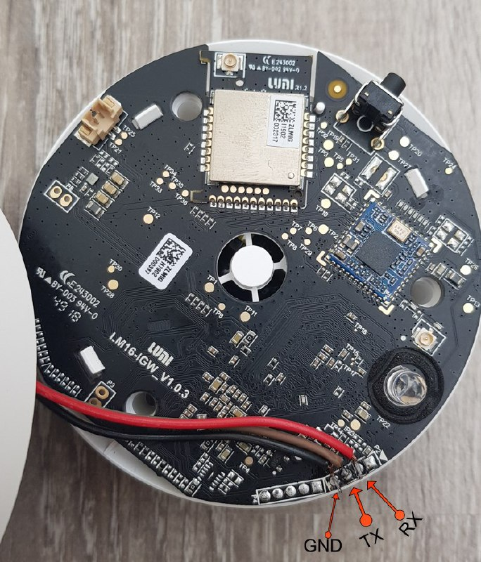

# Gaining root

Solder 3 contacts GND, RX, TX to UART:


 

Then connect UART 2 USB adapter. To use serial console while booting, you 
can use minicom/picocom on Linux or PuTTY on Windows. Use baudrate 115200.
Stop booting by pressing any key in the uart terminal right after powering the
device. If it not stops with prompt `=>` you should reboot the gateway by 
plugging it off and then on. 

Prepare a new password for the root user. It can be blank, but you have to 
confirm it after setting it in the console.

Enter the following line and boot will start:

```
setenv bootargs "${bootargs} single rw init=/bin/bash" && boot
```

As an alternative, if you're bash input displays weird characters, use sh instead of bash
```
setenv bootargs "${bootargs} single rw init=/bin/sh" && boot
```
After booting to linux bash console, enter: 

```shell
passwd
```

Enter the prepared password 2 times. In case of an empty password, you have to 
press enter one more time to confirm it.

In case your password change is failing over and over again due to mismatched passwords - change it with following oneliner:
```
usermod --password $(echo NEW_PASSWORD | openssl passwd -1 -stdin) root
```

__NOW YOUR GATEWAY HAS ROOT__


Newer firmwares can provide init script with disabled shell login on the normal 
start and display this message:

```sh
INIT: no more processes left in this runlevel
```

Enable getty on serial console. If you have an older firmware, you can run this command as well, it will run as 
no-op.

```sh
sed -i "s/#mxc0/mxc0/" /etc/inittab && sync
```

To enable ssh server on the gateway add the following line at the end of 
`/etc/rc.local` before the `/home/root/fac/fac_test` line:

```shell
/etc/init.d/dropbear start &
```

Now you can reboot and connect to your gateway at `*GATEWAY_IP*`, port 22.


If you receive an error:
```
Starting Dropbear SSH server: Pseudo-terminal will not be allocated because stdin is not a terminal.
ssh: connect to host rsa port 22: Connection refused
```

It means that your dropbear is compiled without ssh-server support and 
can serve only as a client. Replace it with a fully functional ssh-server:

```shell
mv /usr/sbin/dropbearmulti /usr/sbin/dropbearmulti.backup
echo -e "GET /openlumi/openlumi.github.io/master/files/dropbearmulti HTTP/1.0\nHost: raw.githubusercontent.com\n" | openssl s_client -quiet -connect raw.githubusercontent.com:443 -servername raw.githubusercontent.com 2>/dev/null | sed '1,/^\r$/d' > /usr/sbin/dropbearmulti
chmod +x /usr/sbin/dropbearmulti
```

## Setting Wi-Fi without Mi Home app.

_You can omit this section in case the gateway is already connected
using Mi Home application._

After rebooting, the gateway enables the testing console. 
To exit to normal login mode, type `exit_factory`, then press enter.

Then log in to the console with the user `root` and password you have set.

### How gateway enables Wi-Fi

While booting, gateway while executing `rc.local` it runs the lines:
```shell
/home/root/set_mac.sh &
/lumi/app/miio/wifi_start.sh > /dev/null 2>&1 & 
```

Those lines check for the file `/lumi/conf/wifi.conf` and if it is absent,
it starts an open Wi-Fi Access Point.

### Creating Wi-Fi config

Run the following lines with your own Network name and password. 
Keep `key_mgmt` as is:

```shell
echo 'ssid="lao_mao"' > /lumi/conf/wifi.conf
echo 'psk="12345678"' >> /lumi/conf/wifi.conf
echo 'key_mgmt=WPA' >> /lumi/conf/wifi.conf
```

Also, you can use `vi` editor to set Wi-Fi credentials:

```shell
vi /lumi/conf/wifi.conf
```
Press `i`, then paste

```
ssid="lao_mao"
psk="12345678"
key_mgmt=WPA
```

Then exit with saving: (Press Esc, then type `:qw` and press Enter)

To check the config is correct you can manually run the lines 
from `/etc/rc.local`:

```shell
/lumi/app/miio/wifi_start.sh 
```

You will see the connection process. Press ctrl+c after you got the info 
if the device is connected or not.
If the Wi-Fi credentials are set correctly, `ifconfig` will show IP address
of the gateway.
