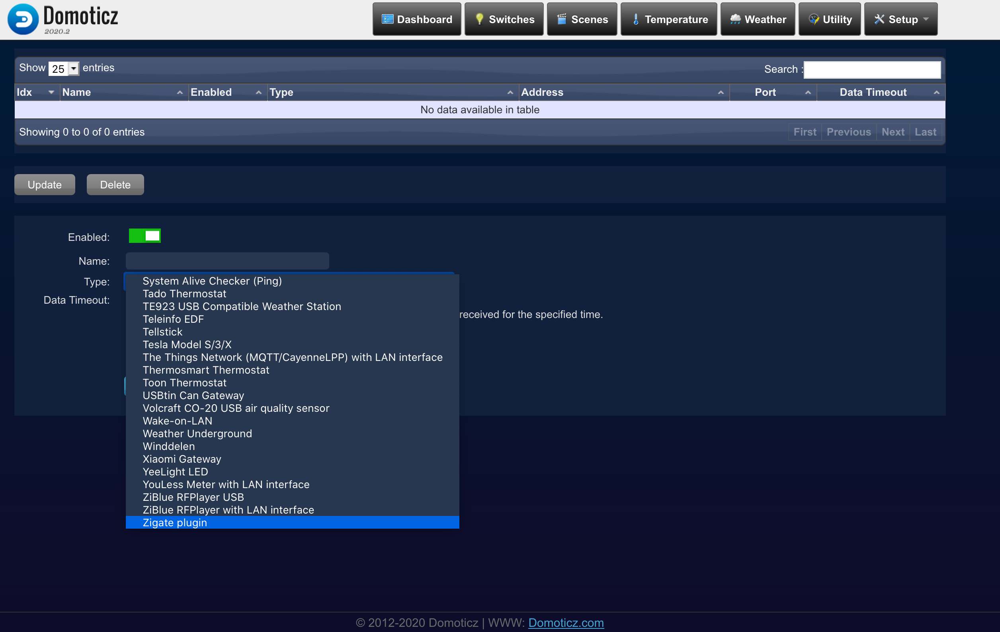
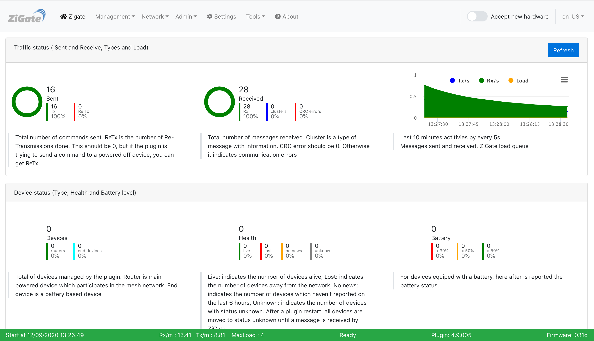

# Прошивка Zigate и подключение Zigate plugin к Domoticz

Для модуля jn5169, установленного на нашем шлюзе используется прошивка ZiGate.
Она уже включена в архив. Чтобы прошить её в модуль, воспользуетесь командой

```shell script
sh /root/flash.sh /root/zigate.bin --erasepdm
```

Если вы уже прошивали модуль ранее прошивкой Zigate или от Zesp, данный шаг 
можно пропустить. Zesp и Zigate совместимы по чати работы с плагином zigate.

## Настройка плагина

Всё что нужно, это в разделе Setup > Hardware добавить элемент с типом
`Zigate plugin`, вписать имя в поле Name и нажать `Add`



спустя несколько минут плагин проинициализируется и запустит панель управления


## Панель управления Zigate



В данной панели вы можете включить режим сопряжения с дочерними устройствами и 
изменять настройки. 
Чтобы включить режим добавления устройств, включите переключатель 
`Accept new hardware` в верхнем правом углу.


Более подробно о панели вы можете прочитать на странице плагина
[https://github.com/pipiche38/Domoticz-Zigate-Wiki/blob/master/en-eng/WebUserInterfaceNavigation.md](https://github.com/pipiche38/Domoticz-Zigate-Wiki/blob/master/en-eng/WebUserInterfaceNavigation.md)

После добавления дочернего zigbee устройства оно появится в интерфейсе domoticz.
